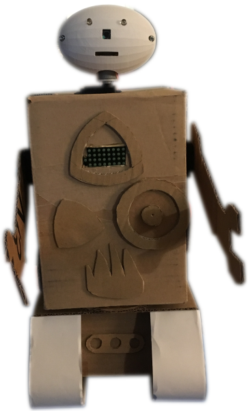

Assigato Remote
===============

Assigato is a robot I am designing with my daughter.  This application functions as a remote control including movement, leds, and audio.  The interface uses websockets for immediate response and multi-user control.



Dependencies
------------

This software requires ruby 2.3.1, bundler, and some system-level tools.

```
sudo apt-get install ruby-dev libffi-dev nodejs espeak
sudo gem install bundler
```

ic2 tools is not necessary but helpful:

```
sudo apt-get install i2c-tools
```

i2c modules need to be loaded as well:

```
echo i2c-dev | sudo tee -a /etc/modules
echo i2c-bcm2708 | sudo tee -a /etc/modules

```

Bundle the local dependencies into the application.

```
bundle install --path vendor/bundle
```

When using PWM audio, use `raspi-config` to force audio to the 3.5mm jack and enable the device overlay:

```
echo "dtoverlay=pwm-2chan,pin=18,func=2,pin2=13,func2=4" | sudo tee -a /boot/config.txt
sudo /sbin/shutdown -r now
```

Running
-------

Run the application in development without hardware control:

```
bundle exec rails server
```

Run the application in production with hardware control (See config/settings/production.yml):

```
bundle exec rails server -e production
```

Running on the pi will be faster if you precompile first:

```
bundle exec rake assets:precompile
```
